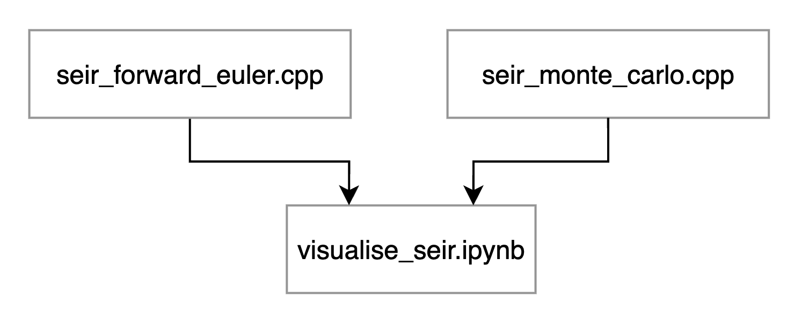

# A C++ implementation of the SEIR model

Lucas Cairnes, do24707

## Description

This project implements the SEIR model (Susceptible, Exposed, Infected, Recovered) using C++. The two implementations are a forward Euler numerical integration model and an agent-based Monte Carlo model. These models are wrapped with Pybind11, imported to a Jupyter notebook, and then visualised for analysis.

## Getting Started

### Dependencies

* C++11
* Python 3.13
* Python dependencies in `requirements.txt`

### Installation

* Clone the repo with `git clone https://github.com/LucasCairnes/SEIR_models`
* Compile `seir_forward_euler.cpp` and `seir_monte_carlo.cpp` with `make`
* Create a Python 3.13 environment
* Install Python dependencies with `pip install -r requirements.txt`

### Executing program

* Open `visualise_seir.ipynb`
* Execute the cells sequentially to run the simulations
* After simulating, view the raw data in `f_euler_seir_data.csv`, `mc_seir_data.csv`, and `mc_lattice_data.csv`

## Code structure

### `seir_forward_euler.cpp`

* A deterministic initial conditions model
* Program takes the SEIR parameters, and begins an integration loop
* Each step, the program calculates the current derivatives of the SEIR values, updates the current SEIR compartments and then saves them to memory
* Once the loop is complete, these stored values are written to a CSV
* The program is wrapped with Pybind11 so the function can be used in Python.

### `seir_monte_carlo.cpp`

* Agent-based stochastic model
* The program takes the initial parameters, allocates discrete agents to each compartment, creates a periodic lattice of given length, and then randomly populates the lattice with agents
* These discrete agents are structs with their current position and state
* Agents are encapsulated by a main System class which orchestrates the simulation
* The simulation loop then begins. The system attempts to move each agent randomly to a neighbouring tile, succeeding if its empty.
* After movement step, probability for each agent progressing to the next compartment is compared to an RNG, if value RNG value is smaller, the agent progresses.
* After step, current SEIR values and states of lattice stored in memory
* Once sim is complete, SEIR values and lattice snapshots are exported to CSVs.
* System class is wrapped with Pybind11 along with main execution function.

### `visualise_seir.ipynb`

* Pybind11 objects imported
* CSVs converted to Pandas Dataframes and then plotted
* Lattice snapshots animated with FuncAnimation

